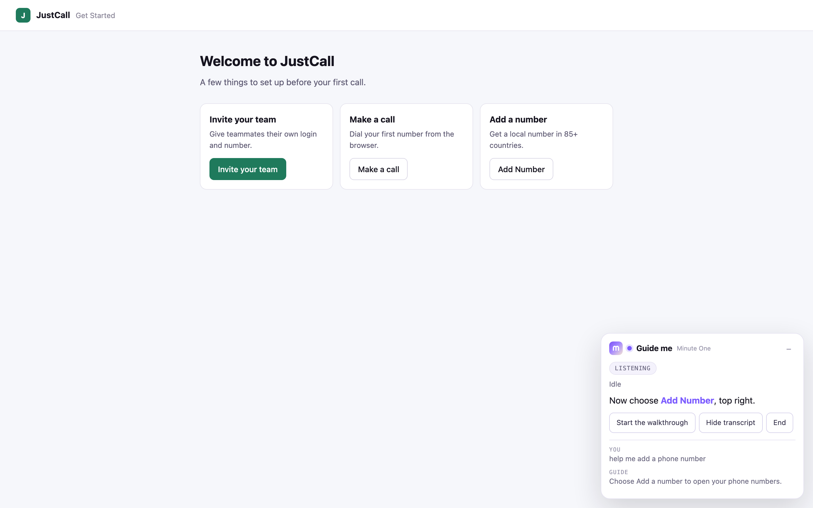
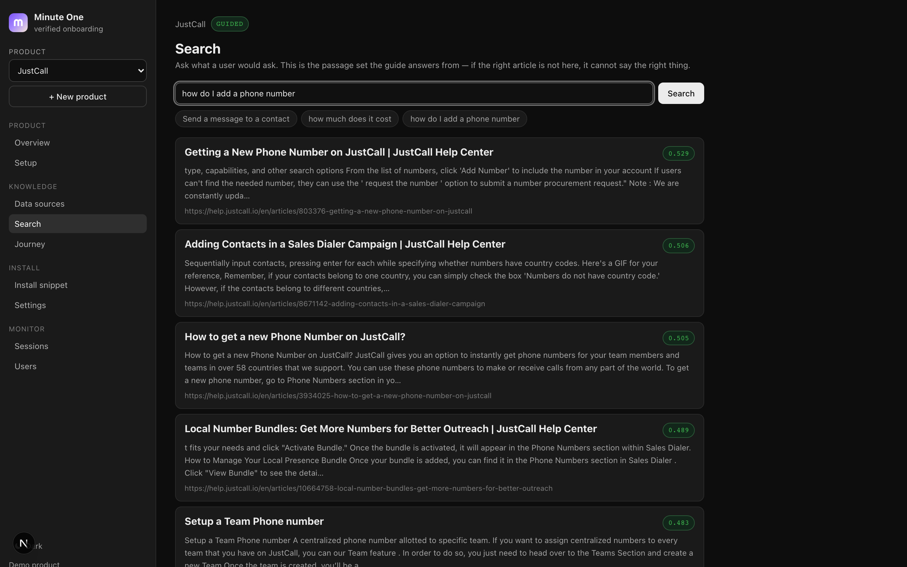

<p align="center">
  
</p>

<h1 align="center">Minute One</h1>

<p align="center">
  <b>Verified conversational onboarding.</b><br />
  A voice guide that walks a user to their first outcome — and refuses to
  advance until the page proves it happened.
</p>

<p align="center">
  <a href="#license"></a>
  
  
  <a href="https://minute-one-ten.vercel.app"></a>
</p>

---

**Project status:** pre-1.0 and under active development. The engine, the
console, the knowledge base and the Deepgram voice path are working end to end
and deployed. The PyAI adapter is written but unverified against a live account.
There is no published npm package yet — you run it from source. See
[Status & roadmap](#status--roadmap).

## Table of contents

- [What it is](#what-it-is)
- [Why it's different](#why-its-different)
- [How it works](#how-it-works)
- [Providers](#providers)
- [Requirements](#requirements)
- [Quick start](#quick-start)
- [Configuration](#configuration)
- [Usage](#usage)
- [Repository layout](#repository-layout)
- [Development](#development)
- [What is real, and what is not](#what-is-real-and-what-is-not)
- [Status & roadmap](#status--roadmap)
- [Security](#security)
- [Contributing](#contributing)
- [License](#license)

## What it is

Minute One is an activation layer that runs **inside** your product. A voice
agent holds the context of your app — your help centre, your UI — watches the
live page, and talks a new user through their first real task one instruction at
a time. The user performs every click; the guide never clicks for them.

The part that matters: **a deterministic controller, not the model, decides when
a step is done.** Every step declares evidence — a route, a piece of text that
must be visible — and the controller checks the page after each instruction. If
the evidence is absent the step stays blocked, the guide explains the mismatch
differently, and a wrong action is visibly caught rather than silently skipped.

It ships as one script tag. The host application changes nothing else.

```html
<script src="https://your-minute-one-host/minute-one.js"
        data-product-key="mo_pk_…"></script>
```

<p align="center">
  
</p>
<p align="center"><em>The guide inside a host application — one instruction, the control it names, and the transcript.</em></p>

<p align="center">
  
</p>
<p align="center"><em>The console's retrieval inspector: exactly what the agent would answer from, with scores. Retrieval fails quietly — this is the screen that catches it.</em></p>

## Why it's different

- **Proof, not optimism.** A guided tour advances because the script says so. A
  chatbot declares success when you stop replying. Minute One advances only when
  the intended result is observable on the page.
- **The user does the work.** Automation completes the task and teaches nothing.
  Here the path is stored as something the user *did*, so they find it again next
  week without help.
- **The model is bounded.** It speaks, rephrases, answers questions and explains
  failures. It cannot mark a step passed, invent a route, or see a password.
- **Retrieval, not prompt-stuffing.** Your help centre is chunked and embedded;
  the agent retrieves the relevant passages per question and answers only from
  them — so the corpus scales past what fits in a prompt.
- **Bring your own keys.** Provider secrets stay server-side; the browser gets a
  short-lived, origin-locked token.

## How it works

Four things in a loop, on every screen the user touches.

```
  user speaks a goal
        │
        ▼
  ┌─────────────┐   journey chosen from what they said (goal phrases)
  │   LISTEN    │   redacted semantic snapshot of the live DOM:
  │             │   roles · names · dialogs · notices — never raw HTML
  └──────┬──────┘
         ▼
  ┌─────────────┐   one spoken instruction, ≤18 words
  │    GUIDE    │   spotlight ring drawn on the real control
  └──────┬──────┘   (resolved by accessible name, test id, or selector)
         ▼
  ┌─────────────┐   controller re-observes and checks the step's declared
  │   VERIFY    │   success rules against the page
  └──────┬──────┘
         │
    passed? ──yes──►  advance · record evidence
         │
         no
         ▼
  ┌─────────────┐   bounded retries, a *different* explanation each time
  │   RECOVER   │   (location → recognition → reset), then offer phone help
  └─────────────┘
         │
         ▼
  every session ends in exactly one recorded state:
  completed · partial · failed · deadline
```

Two rules hold the whole design together:

1. **The controller owns progression.** The voice provider may speak, listen and
   request tools; it has no API for marking a step successful.
2. **A step with no declared proof never passes.** An empty success rule is
   treated as unproven, so an unfinished journey fails closed rather than open.

Alongside the journey, the agent can answer questions at any time via a
`search_knowledge` tool that queries a pgvector index of your help centre. While
a step is open, **the authored step outranks any retrieved article** — help
articles describe every route a product supports; a journey is the one route you
chose and proved.

## Providers

Voice is a swappable role behind one interface (`VoiceAdapter`). Speech-to-text,
the LLM and text-to-speech are configured per session by the server.

**The server decides from its own environment, and the client falls back.** At
boot, `/api/minute-one/config` reports which providers this deployment holds a
key for, in preference order. The widget tries them in turn and keeps the first
socket that opens, so a vendor being unreachable costs a fallback rather than
the session — and the provider that *actually* connected is the one recorded on
the session, because a proof naming the vendor you tried would be worthless.

| Provider | Role | Required key |
| --- | --- | --- |
| **PyAI Omni** | **Default.** Used whenever `PYAI_API_KEY` is set | `PYAI_API_KEY` |
| **Deepgram Voice Agent** | Automatic fallback, and the default without a PyAI key | `DEEPGRAM_API_KEY` |
| **Mock** | Scripted, no key — tests and `?voice=mock` | — |

Set both keys and you get PyAI with a live safety net. Set one and that one is
used. Set neither and the widget says so instead of pretending.

Falling back between real providers is automatic. Dropping to the **mock** never
is: that stays an explicit choice after a visible failure, so a scripted preview
can never be mistaken for a live call.

Embeddings for the knowledge base use any OpenAI-compatible endpoint
(`text-embedding-3-small` by default).

## Requirements

- **Node.js 22+**
- A **PyAI** key for voice (or a **Deepgram** key — either works, both is best)
- An **OpenAI** (or compatible) key for the knowledge base
- A **NeonDB** connection string (Postgres + `pgvector`) — products, journeys,
  sessions and embeddings live there

Without `DATABASE_URL` the product store falls back to a local JSON file, so the
tests and an offline dev loop run with no database at all.

## Quick start

**No keys, no database, about two minutes.** Sample products, journeys and
knowledge ship in the repository, so a fresh clone has something to look at:

```bash
git clone https://github.com/arunav25/minute-one.git
cd minute-one
npm install
node scripts/seed-products.mjs   # loads examples/sample-products.json
npm run dev                      # http://localhost:3200
```

Then open:

| URL | What's there |
| --- | --- |
| `/` | The landing page |
| `/console` | Two seeded products, three journeys, knowledge sources, sessions |
| `/embed-test` | A stand-in customer app with the widget installed |
| `/embed-test?voice=mock` | Forces the scripted adapter even when keys are present |

With no keys set, `/embed-test` runs the journey on a **scripted voice adapter**
automatically — the real engine, the real verifier and the real overlay, with
the voice stubbed and labelled as such throughout. Nothing claims to be real
voice that is not: the report says `isRealVoice: false`. Add a key and the same
page uses it, PyAI first.

**To add real voice and retrieval**, copy `cp .env.example .env.local`, add the
keys you have, and restart. Voice additionally needs TLS (below) because
browsers only grant microphone access on a secure origin.

**Voice needs HTTPS.** Browsers only grant microphone access on a secure origin,
so for a real voice session use:

```bash
npm run dev:https              # generates a local cert, then serves on https
```

## Configuration

Copy `.env.example` to `.env.local`. Every value is server-side; none is bundled
into the browser script.

| Variable | Purpose | Default |
| --- | --- | --- |
| `PYAI_API_KEY` | Voice, preferred. Exchanged server-side for a short-lived browser token | — |
| `PYAI_ALLOWED_ORIGINS` | Spend gate for PyAI mints. Supports `https://*.example.com` | — |
| `PYAI_AGENT_ID` | Adopt a Voice Agent built in the PyAI console | — |
| `DEEPGRAM_API_KEY` | Voice, used as the fallback (or the default with no PyAI key) | — |
| `DEEPGRAM_ALLOWED_ORIGINS` | Spend gate: origins allowed to mint voice tokens. Supports `https://*.example.com` | — |
| `DEEPGRAM_LISTEN_MODEL` | Speech-to-text | `flux-general-en` |
| `DEEPGRAM_THINK_MODEL` | Conversation model | `gpt-4o-mini` |
| `DEEPGRAM_SPEAK_MODEL` | Text-to-speech | `aura-2-thalia-en` |
| `OPENAI_API_KEY` | Embeddings for the knowledge base | — |
| `EMBEDDING_MODEL` | Must match between ingest and query | `text-embedding-3-small` |
| `DATABASE_URL` | NeonDB (Postgres + pgvector) | falls back to `.data/` JSON |
| `NEXT_PUBLIC_HELP_NUMBER` | Shown on the phone-help card | — |

## Usage

**1. Create a product** in the console. You get a public `mo_pk_…` key — it
selects context, it cannot authorise voice.

**2. Add knowledge.** Paste text or Q&A pairs in *Data sources*, or import a help
centre archive:

```bash
node scripts/ingest-knowledge.mjs ./help-archive mo_pk_… --include=scripts/knowledge-onboarding.txt
```

Use *Search* in the console to see exactly which passages the agent would
retrieve for a question, with similarity scores. Retrieval failures are quiet by
nature — this is the screen that catches them.

**3. Author a journey.** Each step names the control to point at and the
on-screen evidence that proves it happened:

```jsonc
{
  "id": "open-numbers",
  "objective": "Open the phone numbers section",
  "instruction": "Choose Add a number to open your phone numbers.",
  "targetName": "Add a number",   // or targetSelector for unlabelled controls
  "successText": "Port Number"    // proof — only visible once the step is done
}
```

A product can hold several journeys; the agent picks one from what the user says.

**4. Install the snippet** on the page you want guided. Add the host's origin to
the product's allowed origins and to `DEEPGRAM_ALLOWED_ORIGINS`.

**5. Watch Sessions** in the console — every run, its provider proof, and a
timeline of what was instructed, checked, failed and recovered.

## Repository layout

An npm-workspaces monorepo.

```
minute-one/
├─ packages/
│  ├─ core/             Engine. Session controller, verifier, budgets, events,
│  │                    report. Knows nothing about products or vendors.
│  ├─ web/              Embeddable SDK: overlay (Shadow DOM), spotlight,
│  │                    DOM observer + redaction, boot-from-key entry point
│  ├─ voice-deepgram/   Deepgram Voice Agent adapter
│  ├─ voice-pyai/       PyAI Omni adapter (unverified)
│  └─ voice-mock/       Scripted adapter for tests and demo mode
├─ app/                 Next.js app — landing page, console, report,
│  └─ api/minute-one/   config · session (token mint) · events · knowledge
├─ src/server/          Server-side stores: products, journeys, knowledge
│                       (pgvector), events, embeddings, origin allowlists
├─ docs/
│  ├─ architecture/     Code map, knowledge base, journeys
│  └─ product/          Roadmap
├─ examples/           Sample products, journeys and knowledge — seeds a clone
├─ scripts/             SDK build, knowledge ingest, seeding, screenshots, certs
├─ e2e/                 Playwright end-to-end tests
└─ public/              Built SDK bundle, brand assets, demo host page
```

Start with [`docs/architecture/overview.md`](docs/architecture/overview.md) for
the code map.

## Development

```bash
npm install          # all workspaces
npm run dev          # http://localhost:3200
npm run dev:https    # same, over TLS — required for microphone access
npm test             # unit + integration (Vitest)
npm run e2e          # end-to-end (Playwright)
npm run typecheck    # strict TypeScript across all workspaces
npm run build        # production build (also rebuilds the SDK bundle)
npm run build:sdk    # rebuild public/minute-one.js only
```

The embeddable bundle is a **build artifact**. After changing anything in
`packages/web` or `packages/voice-*`, run `npm run build:sdk` — or the page will
load a stale widget. `npm run build` does it for you.

Common traps (dev certificates and the microphone, tunnel origins, stale
bundles) are collected in [`docs/troubleshooting.md`](docs/troubleshooting.md).

## What is real, and what is not

This section is deliberately blunt, because the product's whole claim is that it
does not overstate what happened.

**Real and verified end to end**

- The verification gate. A step passes only on declared, observed evidence.
- Deepgram voice: token mint, live session, barge-in, transcripts, tool calls.
- Retrieval: help-centre ingest → pgvector → `search_knowledge` mid-conversation.
- The console: products, data sources, retrieval search, journeys, sessions.
- Multi-journey routing from natural speech.
- Persistence in NeonDB, so a deployed instance keeps its state.

**Not real yet**

- **PyAI spoken round trip** — the adapter is the default path and its server
  mint is verified against the live API (`omni.createSession` returns a real
  origin-locked token and Omni socket URL), with provider fallback covered by
  tests. The full spoken conversation has been exercised end to end on Deepgram;
  on PyAI the socket has not yet been driven with a microphone, so treat that
  last leg as unproven until you run it with your own key.
- **Phone hand-off** — the browser has no carrier leg. Accepting shows a number
  and a session reference; it does not transfer a call.
- **Journey editing for multiple journeys** — the console's editor still assumes
  one journey; author additional ones through the API.
- **Auth and multi-tenancy** — the console is unauthenticated and single-tenant.
  Do not expose it publicly. See [SECURITY.md](SECURITY.md).
- **Published package** — no npm release; run from source.

**Deliberately absent** — screenshot or vision-based navigation, an agent that
clicks on the user's behalf, a general-purpose browser agent.

## Status & roadmap

**Now** — shipping inside JustCall as the first activation flow.
**Next** — verify the PyAI adapter, multi-journey editing in the console, an
npm-published widget.
**Then** — authentication and multi-tenancy, design partners across adjacent
SaaS.

Details in [`docs/product/roadmap.md`](docs/product/roadmap.md).

## Security

- Provider keys are **server-side only**. The browser receives a short-lived
  bearer token, origin-locked to the product's allowlist.
- The page observer sends a **redacted semantic snapshot** — roles, names,
  headings, dialogs — never raw HTML, never form values, never password fields.
- The public `mo_pk_…` key selects context. It cannot mint voice on its own.
- Sessions are bounded by time, step count and voice minutes.

Report vulnerabilities privately — see [SECURITY.md](SECURITY.md). Please do not
open a public issue for a security problem.

## Contributing

Contributions are welcome. Read [CONTRIBUTING.md](CONTRIBUTING.md) first — it
covers the ground rules (never commit secrets; the core stays vendor-neutral;
nothing but the controller may advance a step), how to add a voice provider, and
the commit style.

## License

MIT © 2026 Saaslabs Technology. See [LICENSE](LICENSE).
